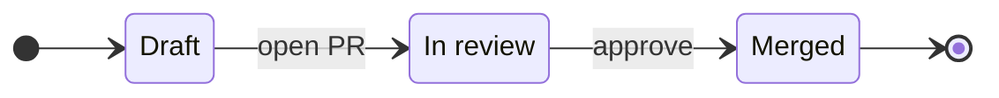
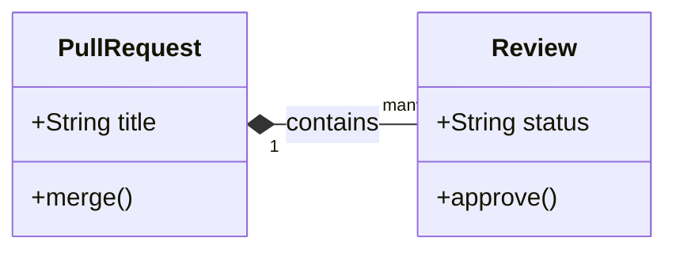

# ma

A CLI tool that renders [Mermaid](https://mermaid.js.org/) diagrams as ASCII art. No browser, no image generation — just text.

## Install

```
cargo install --path .
```

## Usage

```
ma [OPTIONS] [FILE]
```

Reads from stdin if no file is given.

```bash
echo 'graph LR
    A --> B --> C' | ma
```

```
┌───┐     ┌───┐     ┌───┐
│ A │────>│ B │────>│ C │
└───┘     └───┘     └───┘
```

### Options

| Flag | Description |
|------|-------------|
| `-w, --width <N>` | Maximum output width in columns |

## Supported Diagrams

### Sequence Diagram

```bash
echo 'sequenceDiagram
    Alice->>Bob: Hello
    Bob-->>Alice: Hi there' | ma
```

```
┌───────┐    ┌─────┐
│ Alice │    │ Bob │
└───┬───┘    └──┬──┘
    │ Hello     │
    │──────────>│
    │           │
    │ Hi there  │
    │< ─ ─ ─ ─ ─│
    │           │
┌───┴───┐    ┌──┴──┐
│ Alice │    │ Bob │
└───────┘    └─────┘
```

Features:
- Arrow types: solid (`->>`, `->`), dotted (`-->>`, `-->`), cross (`-x`, `--x`), bidirectional (`<<->>`, `<<-->>`)
- Participant aliases (`participant A as Alice`)
- Activation / deactivation (`activate`, `deactivate`, `+` / `-` shorthand)
- Self-messages (rendered as loops)
- Notes (`note right of`, `note left of`, `note over`)
- Blocks: `loop`, `alt`/`else`, `opt`, `break`, `par`/`and`, `critical`/`option`, `rect`
- Create / destroy participants
- Auto-numbering (`autonumber`)

### Flowchart (Graph)

Supports both `graph` and `flowchart` keywords with TD (top-down) and LR (left-right) directions.

```bash
echo 'graph TD
    A{Decision} -->|Yes| B[Action]
    A -->|No| C(Skip)' | ma
```

```
      ────────
     ╱        ╲
    │ Decision │
     ╲        ╱
      ────┬───
     ┌────┴──────┐
     ▼           ▼
┌────────┐   ╭──────╮
│ Action │   │ Skip │
└────────┘   ╰──────╯
```

Features:
- Directions: TD/TB (top-down), LR (left-right)
- Node shapes: rectangle `[]`, round `()`, diamond `{}`, circle `(())`, stadium `([])`, subroutine `[[]]`, cylinder `[()]`, hexagon `{{}}`
- Edge types: arrow `-->`, open `---`, dotted `-.->`, thick `==>` (and link variants)
- Edge labels (`-->|label|` or `-- label -->`)
- Fan-out / fan-in with L-shaped edge routing
- Cycles: edges that point backwards are routed around the nodes
- Self-loops (`A --> A`)
- Subgraphs (`subgraph`...`end`)
- Multi-target edges (`A --> B & C`)
- Chained edges (`A --> B --> C`), including fan-out chains

### ER Diagram

```bash
echo 'erDiagram
    CUSTOMER ||--o{ ORDER : places
    ORDER ||--|{ LINE_ITEM : contains' | ma
```

```
┌──────────┐              ┌───────┐                ┌───────────┐
│ CUSTOMER │||──places──o{│ ORDER │||──contains──|{│ LINE_ITEM │
└──────────┘              └───────┘                └───────────┘
```

Features:
- Cardinality symbols: `||` (exactly one), `o|`/`|o` (zero or one), `}|`/`|{` (one or many), `}o`/`o{` (zero or many)
- Entity attributes
- Entity aliases and attribute comments
- Identifying (`--`) and non-identifying (`..`) relationships
- Relationship labels

### State Diagram

`stateDiagram-v2` and `stateDiagram` cover workflow descriptions commonly used in pull requests.



Features:
- TD/TB and LR directions
- Simple states, aliases (`state "Label" as id`), and inline descriptions (`id : Label`)
- Labeled transitions and start/end markers (`[*]`)

Composite states, forks, joins, choices, and concurrency are not supported yet.

### Class Diagram



Features:
- Class declarations, aliases, annotations, attributes, and methods
- Block members and `Class : member` syntax
- Inheritance, realization, dependency, association, aggregation, and composition relations
- Relationship labels; aggregation/composition semantics are included in the ASCII label

Namespaces, nested class groups, and bidirectional relations are not supported yet. Multiplicities are accepted for endpoint parsing but are not drawn.

## Unicode Support

Full-width characters (CJK, emoji) are handled correctly in layout calculations.

## License

MIT
